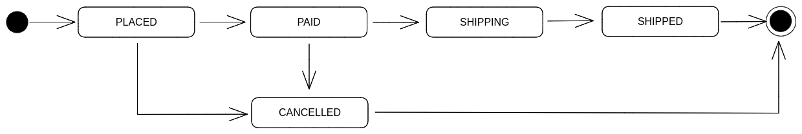

# Order Management System

## How to run
- `docker compose up` 
- An instance of the web application will be up and can be access at port `8082`
## Use cases:
- Users/Vendor Log in/Sign up
- User view products
- User add/remove the product from the cart
- Create new order from a set of items in the cart
- View list of products
- Manage products/inventory
- Users/vendors can log in, sign up
- Users/vendors can manage their own orders
- Export CSV for orders (vendor/user)

## Assumption
- An order is at `paid` state right after its creation

## Implementation
### Tech stack:
    - [echo](https://github.com/labstack/echo)
    - [gorm](https://github.com/go-gorm/gorm)
    - [Next.js](https://nextjs.org/)
    - [PostgreSQL](https://www.postgresql.org/)
### Entities
- User
- Product
- Product Price
- Product Transaction
- Order
- Order Item
- Order Transaction
- Cart
- Cart Item
- Payment Method
### Process
- The price of a product could be changed and recorded over time (represented by `Product Price`). The latest price will be the price of the product.
- The `product transaction` represents an action on changing a product stock quantity
- The `order transaction`  represents a change in the state of an order  (e.g. `paid` -> `placed`, `placed` -> `shipping`, etc.)
- The total quantity of a product is calculated by  summing up all of its product transactions' quantity 
- An user can add products of different vendors to cart and checkout all at once. The created orders will be grouped by the vendors of purchased products. For example, if user has added products which are belongs to 2 vendors, after checkout, there will be 2 orders created.
- Order status:

### Realtime cart:


`Realtime cart` is implemented using websocket. A centralized hub monitors the client connection list that are grouped by `user id`. When there are any changes in the cart, an event will be broadcast to all clients of the user.

## Development
### Backend
- Using [air](https://github.com/cosmtrek/air) for live-reload server
- Make sure that `air` is installed and run this command in `server` folder:
```
air
```

### Frontend
- `yarn install`
- `yarn dev`
