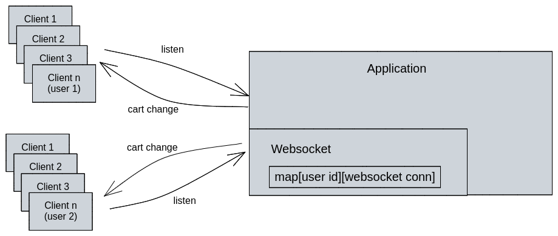

- The price of a product could be changed over time
- The transaction is used to record the action on a product
- Flows:
    - Pick items from cart -> Pay -> Order created (shipping status).
        - Shipped
        - Cancelled

- Real-time cart:

